<a id='ancora'></a>
# Processo Seletivo - QA

<br>

<br><br>

- [Sobre o SENAI - Soluções Digitais](#ancora1) <br>
- [Sobre o Desafio](#ancora2) <br>
- [Sobre o Projeto](#ancora3) <br>
- [Competências Desenvolvidas](#ancora4) <br>
- [Execução](#ancora5) <br>
- [Pontos de Melhoria](#ancora6) <br>
- [Desenvolvedor](#ancora7)

<br><br>

<a id="ancora1"></a>

## Sobre o SENAI - Soluções Digitais

<br>

<br>

<p align="center">
  
</p>

<br>

O SENAI/SC Soluções Digitais (SD) foi criado em 2006 como o nome de Núcleo de Inovação com apenas 4 pessoas, e ao longo dos anos foi evoluindo até em 2022 se tornar SD.
Hoje, o SD conta com mais de 120 profissionais na área de tecnologia, trabalhando na implantação e execução das competências de Infraestrutura em Nuvem, Sistemas Web (Aplicativos e Softwares) com soluções confiáveis para garantir a rentabilidade do seu negócio.

<br>

<a id="ancora2"></a>

## Sobre o Desafio

<br>

A prova deverá utilizar as seguintes tecnologias: 
- Linguagem de programação orientada a objeto para web
- Banco de dados relacional
- GIT

Fica à sua escolha quais frameworks e servidor serão utilizados, desde que seja uma aplicação web. 

Na etapa da entrevista deverá ser apresentado a aplicação em funcionamento.

<br>

<a id="ancora3"></a>
## Sobre o Projeto

<br>

Para este projeto foram utilizadas as seguintes tecnologias:  

            


<br>

## O Projeto

<br>

<p align="center">
  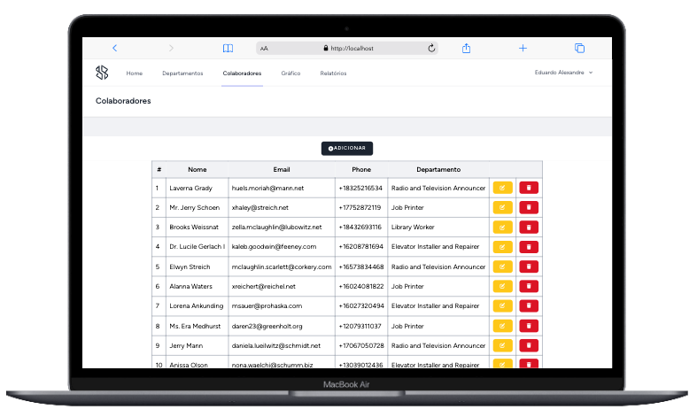
</p>

<br>

### Resumo
O projeto consiste em uma plataforma para micro-gerenciamento de recursos humanos. Conta com a possibilidade de cadastros laborais por Departamento e de Colaboradores. Além disso, é possível a visualisação de gráfico de dashboard de número de colaboradores por departamento e a criação de relatórios em PDF, impressão ou copiar as tabelas para área de transferência.

<br>

### Back-end / API
Para este projeto a criação Back-end seguiu boas práticas de programação e documentação. Utilizando o PHP e seu mais famoso framework: o Laravel, foi criado uma aplicação monolítica em camadas seguindo o design pattern DDD (Domain Driven Design). 
O Framework Laravel possui uma arquitetura voltada ao MVC (Model, View, Controller), entretanto é possível com algumas alterações protegermos melhor as dependências, domínios e regras de negócio do projeto. Para a construção de um modelo arquitetural DDD foram implementadas duas camadas a mais na aplicação: Uma de Repositories e outra de Services.

* Respositories: A camada de Repositories ficou responsável pela relação Modelo/Entidade da aplicação e pelo controle da integração com o Banco de Dados através do `Eloquent`. Com isso conseguimos utilizar dois dos princípios SOLID: o `Single Responsability Principle` pois cada classe do repositorio tem apenas a finalidade de interagir com sua respectiva entidade, e o `Open-Closed Principle` já que fica possível integrar a interface de repositório novas formas de consulta com o `Eloquent`.

* Services: A camada de Services está interligada à camada Repositories pois a mesma utiliza suas interfaces para construção das regras de negócio obedecendo o Design Pattern `Dependency Injection`. Além disso, fica responsável por comandar o Controller para integração dos Endpoints da API.

Com esta configuação o Back-end monolítico da aplicação consegue ter duas finalidades: fornecer os dados necessários para o Front-end por serviços de rotas utilizando o `Inertia` e também disponibilizar endpoints de API para qualquer tipo de integração entre sistemas.

* Documentação: Foi utilizado também o `Insomnia Documenter` para documentação dos endpoints da API. O link e repositório da documentação está disponível abaixo:

[Documentação API - SENAI QA](https://doc-senai-qa.vercel.app/)

[Repositório da Documentação](https://github.com/DuAlexandre/doc-senai-qa)

<br>

### Banco de Dados
O Banco de Dados utilizado no projeto é o `PostgreSQL`. O mesmo encontra-se já configurado em ambiente `Docker` para facilitar a implementação em produção, ou mesmo a reprodução da aplicação em qualquer sistema operacional.
Para evitar a inserção de dados indesejáveis no banco de dados principal do projeto durante a execução dos testes, foi acrescentando ao arquivo `phpunit.xml` a configuração do `SQLite` em memória. Com isso todos os dados mockados ficariam armazenados apenas temporariamente. 

<br>

<p align="center">
  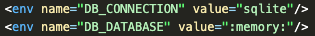
</p>

<br>

### Infraestrutura
A infraestrutura da aplicação foi desenvolvida em `Docker` e toda sua configuração já está anexada ao projeto no arquivo `docker-compose.yml`. Com isso back-end, banco de dados, migrations e seeders poderão ser ativados com apenas alguns comandos.

<br>

### Front-end

O Front-end do projeto foi construido utilizando o framework `Vue3` para componentização, `Vite` para auxílio da criação da estrutura do código e redução de tempo de compilação e `TailwindCSS` para estilização de classes de componentes.

<br>

### Testes

* TDD: Também foi incorporado ao projeto, na parte de back-end utilizando o `PHPUnit`, o método de desenvolvimento TDD (Test Driven Development) onde todo processo de desenvolvimento obedece o chamado ciclo `red-green-refactor`.


<p align="center">
  
</p>

<br>

- RED: Primeiro teste a ser escrito, que quando for executado irá falhar.
<p align="center">
  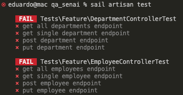
</p>

<br>

- GREEN: Após isso, foi implementado um código sucinto o suficiente para que faça com que os testes sejam aprovados.
<p align="center">
  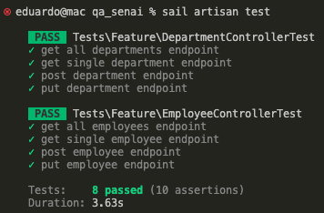
</p>

<br>

- REFACTOR: Momento em que o código foi de fato escrito, orientando-se por manter os testes aprovados. Foram testados 8 endpoints da API, com pouco mais de 150 verificações de resposta.

<p align="center">
  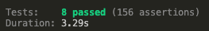
</p>

<br>

Na árvore de Commits é possível observar que em todos os momentos de criação de uma nova entidade a branch `feature/backend-tests` antecede qualquer outra branch.

<p align="center">
  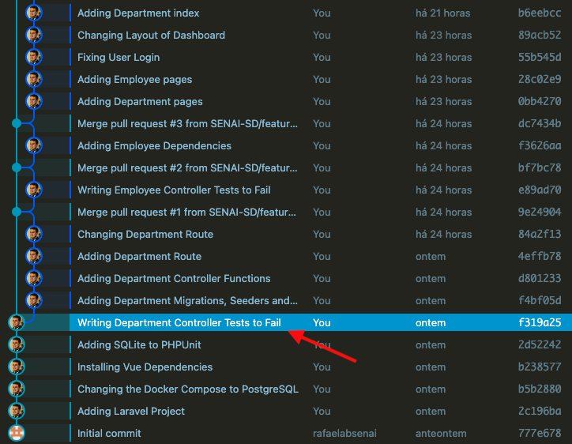
</p>

<p align="center">
  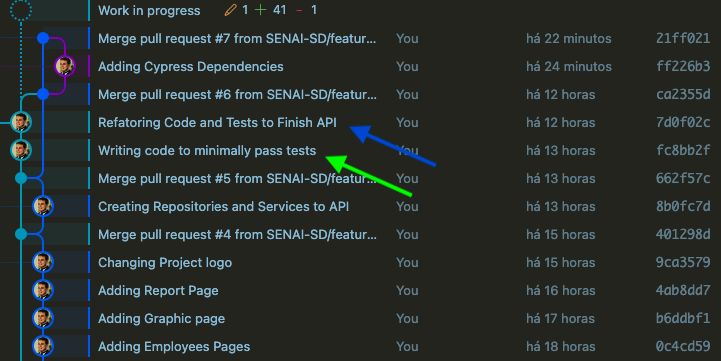
</p>

<br>

<br>

* Cypress: Para testes de componentes do front-end foi configurado minimamente o Cypress para verificação de compilação dos `components` desenvolvidos.

<p align="center">
  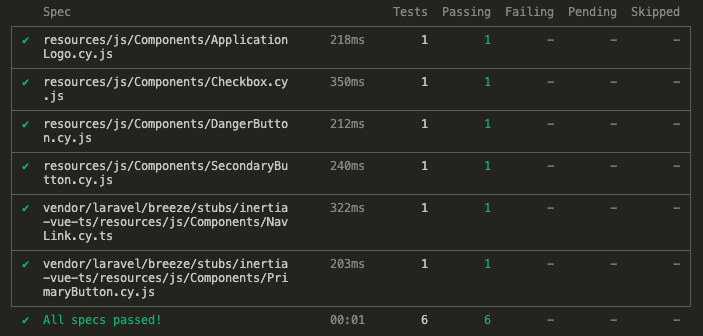
</p>

<br>

<a id="ancora4"></a>
## Competências Desenvolvidas

<br>

* Construção de ambiente `PHP`, `PostgreSQL` e `Apache Server` com `Docker`;
* Desenvolvimento de endpoints de API para integrações;
* Criação de documentação da API com `Insomnia Documenter`;
* Desenvolvimento de Aplicação Monolítica com rotas de integração com o Frontend usando o `Inertia`;
* Arquitetura seguindo boas práticas de `Design Patterns` como `SOLID`, `DDD`, dentre outros;
* Testes de endpoints com `PHPUnit` seguindo metodologia do `TDD`;
* Mock de dados utilizando o `Faker` e armazenamento de dados de teste no `SQLite`;
* Melhoria de performance de compilação do Frontend com `Vite`;
* Testes de componentes `Vue` utilizando o `Cypress`;

<br>

<a id="ancora5"></a>
## Execução 

<br>

1. Clone este repositório remoto em seu equipamento:
```
git clone git@github.com:DuAlexandre/senai_qa_challenge.git
```

2. Acesse a pasta do projeto:
````
cd senai_qa_challenge/qa_senai 
````

3. Renomeie o arquivo `.env.example` para `.env`;

4. Instale as dependências do composer:
````
composer install
````

5. Crie um alias para uso do sail no Docker:
`````
alias sail="bash ./vendor/bin/sail"
`````

6. Inicialize os Containers do Docker:
````
sail up -d
````

7. Crie uma chave de API com o Docker para o arquivo `.env`;
````
sail artisan key:generate
````

8. Faça a Migration para criar as tabelas no banco de dados:
`````
sail artisan migrate
`````

9. Utilize o Seeders para popular o banco de dados:
`````
sail artisan migrate --seed
`````

10. Instale as dependências do Node:
`````
npm install
`````

11. Execute a aplicação:
`````
npm run dev
`````

12. A aplicação estará rodando no endereço:
`````
http://localhost
`````

<br>

### Execução (Opcionais)

<br>

- Testes de Backend com `PHPUnit`:
`````
sail artisan test
`````

- Testes de Components com `Cypress`:
`````
npx cypress open
`````

<br>

### Uso da Aplicação

<br>

A Aplicação utiliza o `Laravel Breeze` para controle de Login. Ao primeiro acesso selecione `Register`:

<br>

<p align="center">
  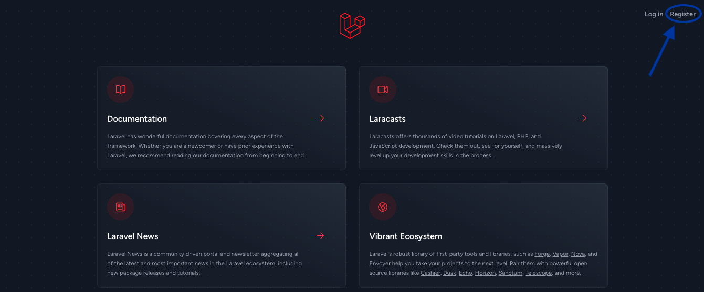
</p>

<br>

<br>

Crie um Usuário e Senha e selecione `Register`:

<br>

<p align="center">
  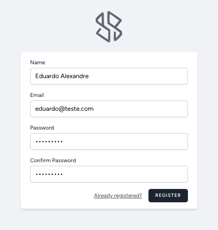
</p>

<br>

<br>

E pronto! 😃 A aplicação foi desenvolvida de forma responsiva. Utilize a vontade:

<br>

<p align="center">
  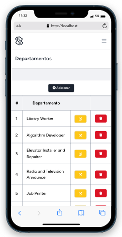
</p>

<br>

<p align="center">
  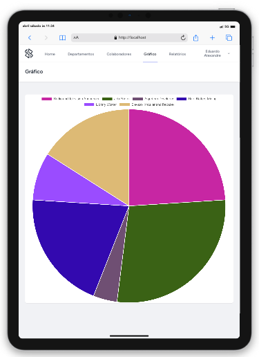
</p>

<br>

<p align="center">
  
</p>

<br>

<br>

<a id="ancora6"></a>
## Pontos de Melhoria

Me faltou tempo para execução dos pontos a seguir. 😅

- Devido a cardinalidade 1:N das tabelas de Departments e Employees, apagar um dado na tabela Department não é possível caso algum Employee esteja vinculado a ele. Acredito que montando algum tipo de sistema de soft-delete ( adicionando um timestamp de deleted_at como exemplo ) resolva esse problema.

- Montar testes de todos os components do frontend com Cypress. Fiz uma quantidade muito pequena de testes de front.

- Criar os testes E2E com Cypress.

- Melhorar responsividade do Dashboard de Employees devido ao seu tamanho lateral.

- Identificar por qual motivo o botão de exportação dos arquivos em Excel não funcionou. Linha 46 - 48 de resources/js/Pages/Employees/Reports.vue

<br>

<br>

<a id="ancora7"></a>
## Desenvolvedor

Projeto desenvolvido por:

<table align="center">
  <tr>
    <td align="center">
      <a target="_blank" href="https://www.linkedin.com/in/eduardo-alexandre025/">
        <br>
        <sub>
          <b>Eduardo Alexandre</b>
        </sub>
      </a>
    </td>
  </tr>
</table>

<br><br>

[Voltar ao Topo](#ancora)
